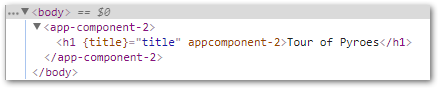

Part 0 - Selectista Mode
########################

The basics
**********

Let's start by using the CLI to create a new application::

  anpylar-application --selectista --tutorial top0

.. note::

   ``--tutorial`` provides predefined styles to the app and the argument
   ``--title "Tour of Pyroes"`` is implicitly added

   To get an an empty ``styles.css`` file and set the title manually::

     anpylar-application --selectista --title "Tour of Pyroes" top0

.. note::

   Notice the option ``--selectista`` to specify a specific behavior when
   generating the skeleton code.

A directory named ``top0`` will be created and populated. ``top0`` stands
obviously for: *Tour of Pyroes - Part 0*

.. note:: If a directory/file named ``top0`` already exists, the CLI won't
          do anything

The newly created ``top0`` directory will contain the following files and
sub-directories::

  ├── app
  │   ├── __init__.py
  │   ├── app_component.css
  │   ├── app_component.html
  │   ├── app_component.py
  │   └── app_module.py
  ├── anpylar.js
  ├── index.html
  ├── package.json
  └── styles.css

Which will be already functional. With the addition of the ``--title "Tour of
Pyroes"`` switch a title will be added to the main component. More on this
later.

.. note:: The actual samples have a

Let's get our hands dirty by serving the application::

  anpylar-serve top0

which will output::

  Sun Dec  3 08:51:47 2027 Server Starts - http://127.0.0.1:2222

Because no port has been specified the default port ``2222``. The full URL to
access the sample is displayed, which can be pasted in the browser.

  http://127.0.0.1:2222

.. note::
   You can also issue a::

     anpylar serve --browser top0

   And *AnPyLar* will do everything in its power to open the browser for you

The server takes care already of delivering the ``index.html`` file and the
result

Let's look at the code and how we can modify the title of our application. The
``app_component.py`` contains the following code

.. tabs::

   .. code-tab:: html app_component.html

      <h1>{title}</h1>

   .. code-tab:: python app_component.py

      from anpylar import Component, html

      class AppComponentComponent(Component):

          title = 'Tour of Pyroes'

          bindings = {}

          def render(self, node):
              node.select('h1')._fmt(title=self.title)

Have a look at them before carrying on.

.. note:: The main purpose in the *selectista* mode for the ``render(self,
          node)`` method is not to directly create DOM elements, but rather to
          *select* them and manipulate them. Of course nothing prevents the end
          user from creating new elements.

.. code-block:: html

      <h1>{title}</h1>

This is just like the *Format Mini Language Specification*. It's not actually
*like*, it's the same. The subustitution is done with the ``_fmt`` method of
the supercharged DOM element with:

.. code-block:: python

          def render(self, node):
              node.select('h1')._fmt(title=self.title)

*AnPyLar* has chosen to shorten the name from ``format`` to ``_fmt``, to make
clear this is not the standard *Python* method (it's different), but will
perform the same actions.

Prefixing the method with ``_`` has been chosen to make also clear that this is
not a standard method of the DOM element, but rather an extension

If we wanted a different title, it is obvious that we simply have to modify the
attribute ``title`` in ``AppComponent`` with the desired value as in::

  title = 'My Tour of Pyroes'

The project is live and therefore transpilation takes place by simple reloading
the page in browser. And the result:

Some explaining
===============

The loading
-----------

A simple look at ``AppComponent`` and modifying ``title`` doesn't tell us much,
so let's try to explain what's happening by first looking into ``index.html``

.. code-block:: html

   <html>
   <head>
     <meta charset="utf-8">
     <meta name="viewport" content="width=device-width, initial-scale=1">

     <link rel="stylesheet" href="styles.css">
     

     <title>AnPyLar Tour of Pyroes</title>
   </head>
   <body></body>
   </html>

As with many other *html* documents, this one sets the title, some meta values
for the browser, loads the stylesheet, it then loads the needed a script
``anpylar.js`` which sets the *AnPyLar* machinery in place and will start it.

The execution
-------------

If no *Python* snippets or links to them are specified, *AnPyLar* will do the
following for you

.. code-block:: python

   import app

   app.AppModule()

This can of course be overridden by the end user by providing specific python
scripts which will kickstart the application. But this matches the code
auto-generated by the ``anpylar`` cli.

We have seen above that things are triggered because an instance of
``AppModule`` is being triggered itself, so let's look into it. One can
obviously find ``AppModule`` inside the :file:``app/app_module.py`` (consistent
naming conventions ... do actually help)

.. code-block:: python

   from anpylar import Module

   from .app_component import AppComponent

   class AppModule(Module):

       components = AppComponent

       bindings = {}

       services = {}

       routes = {}

       def __init__(self):
           pass

Fairly simple, so let's concentrate on ``components = [AppComponent]``.

  - This is telling ``AppModule`` that it should bootstrap ``AppComponent``
    during initialization.

    .. note:: ``components`` is plural because it could also be a *list/tuple*
              with several items to be bootstrapped during initialization

The rest of items will be needed with more complex setups, but are
auto-generated by the cli.

We can also have a look into ``__init__.py`` which is the standard entry point
in Python packages.

.. code-block:: python

   from app import AppModule

It is simply making ``AppModule`` available for the world and specifically in
this case, this is being used in ``index.html`` to kick-start the entire
system.

Coming back to ``AppComponent``
-------------------------------

Our component has no html code or specific styling built-in, but the project
layout shows three files that seem to be related::

  ├── app
  .   ...
  │   ├── app_component.css
  │   ├── app_component.html
  │   ├── app_component.py
  .   ...

And indeed, they are.

  - Inside ``app_component.py`` we have defined ``AppComponent``. It could have
    had any name, but as pointed out above: consistent naming conventions do help!

  - And with the default configuration of our component, the following will
    happen behind the scenes:

    - A base filename ``app_component`` is derived from the class name
      ``AppComponent``.

      The rules are easy: place ``_`` (underscore) signs at the boundary
      between lower and upper-case letters and then lowercase the result

  - When the component is being loaded:

    - ``app_component.css`` will be loaded and the resulting styles used inside
      the component (you can actually find it under the ``<head>`` tag,
      following html standards)

    - ``app_component.html`` will be loaded and prepared as a set of DOM
      nodes. This result will be passed to the ``render(node)`` method, for the
      end user to be able to manipulate the nodes.

In our ``top0`` tutorial, there are no specific styles for the component and
``app_component.css`` is empty.

Although the example is rather short it already shows several of the powers of
a *Component* when developing with *AnPyLar*.

Some notes
**********

If you have been working with some other platforms, including *angular*, you
may have noticed a couple of things:

.. rubric:: Selector

There is no ``selector`` being defined in ``AppComponent``

Actually, there is and you as end user can define it as in

.. code-block:: python

     class AppComponent(Component):
         selector = 'my-selector'

*AnPyLar* tries to make your life easier by auto-generating the
``selector`` if you provide none. See the resulting DOM elements

In this case the auto-generated *selector* is clearly named:
``app-component-2``. Easy naming. If you wonder why the suffix ``-2``, this is
simply to avoid another ``AppComponent`` (which could exist in another ``.py``
file) overwrote our selector, because it will get assigned another ``-x``

.. rubric:: Filenames

There is no indication that the html of the component is in a file named
``app_component.html`` (and the same with styles and ``app_component.css``)

Actually, there is and you can change it. Subclasses of ``Component``
inherit two attributes (see the reference documentation) which control
this. They look like this:

.. code-block:: python

   class Component:
       htmlpath = True
       stylepath = True

By being set to ``True`` the default behavior is to look for the
aforementioned files for a component named ``AppComponent``, but you can
change that by doing this

.. code-block:: python

   class Component:
       htmlpath = 'my_app_component.htmlx'
       stylepath = 'mystyles/my_app_component.css'

And those will be the filenames to be fetched. Note how paths and own
extensions can be specified. *AnPyLar* will make no effort to check the
validity of those.
