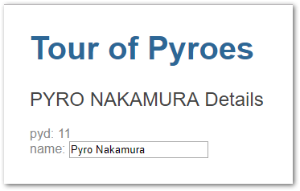
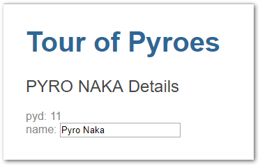
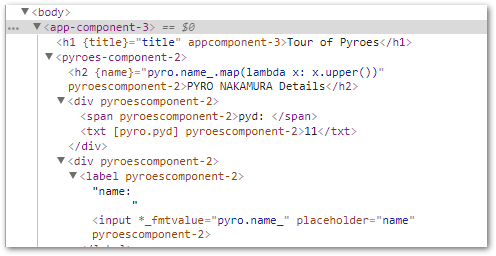

Part 1 - Editing Pyroes
***********************

Component auto-generation
=========================

Having seen the basic layout of the application and how the basics of a
*Component* look like, we can work our way up the ranks to create a **Pyro
Editor**.

Copy the ``top0`` folder to ``top1`` and enter it. For example, with::

  cp -r top0 top1
  cd top1

.. note:: Under *Windows* and unless you have a proper shell installed
          (*Cygwin*, *MSYS*, *GitBash*, ...) you are probably better off
          using the *Windows Explorer* to make a copy of the directory)

From inside the app directory create the skeleton for a *Component*::

  cd app
  anpylar-component Pyroes

.. note:: If the name of the component to add doesn't end with *Component*, it
          will be automatically added

For small projects/components one can include the html content directly in the
component. Let's generate it automatically::

  anpylar-component --htmlsheet Pyroes

The generated python code would look like this in each case

.. tabs::

   .. code-tab:: python __init__.py

      from .pyroes_component import PyroesComponent

   .. code-tab:: python pyroes_component.py

      from anpylar import Component, html

      class PyroesComponent(Component):

          bindings = {}

          def render(self, node):
              pass

   .. code-tab:: python pyroes_component.py (with ``--htmlsheet``)

      from anpylar import Component, html

      class PyroesComponent(Component):

          htmlsheet = '''
          '''

          bindings = {}

          def render(self, node):
              pass

The addition of ``--htmlsheet`` has added an attribute with that name which
is a *literal string* in Python. We could then add the content as in::

      htmlsheet = '''
      <h1>My Heading 1</h1>
      '''

In both cases the generated component is imported into ``__init__.py`` to make
it easy available for others to import it.

The layout
==========

With our additions (let's stick to having html content in a separate file), the
layout looks like this

.. tabs::

   .. code-tab:: none Layout

       ├── app
       │   ├── pyroes
       │   │   ├── __init__.py
       │   │   ├── pyroes_component.css
       │   │   ├── pyroes_component.html
       │   │   └── pyroes_component.py
       │   ├── __init__.py
       │   ├── app_component.css
       │   ├── app_component.html
       │   └── app_module.py
       ├── anpylar.js
       ├── index.html
       ├── package.json
       └── styles.css

   .. code-tab:: none Layout with ``--htmlsheet``

       ├── app
       │   ├── pyroes
       │   │   ├── __init__.py
       │   │   ├── pyroes_component.css
       │   │   └── pyroes_component.py
       │   ├── __init__.py
       │   ├── app_component.css
       │   ├── app_component.html
       │   ├── app_module.py
       │   └── pyro.py
       ├── anpylar.js
       ├── package.json
       └── styles.css

Out of curiosity, had we applied the ``--htmlsheet`` command line switch, the
layout would miss one of the files: ``pyroes_component.html``, because the html
content would be inside the component.

The Editor
==========

A Pyro
------

Actually, and before editing we are going to define a ``Pyro``. As you may have
seen in the layout above, we have added a ``pyro.py`` file to the ``app``. Not
much is actually needed:

  - A ``name`` (what's a *Pyro* without one!)

  - A ``pyd`` to make them unique in case two or more chose to bear the same
    names (yes even Pyroes could suffer from vanity!)

Add ``pyro.py`` to the hierarchy (let's put the ``--htmlsheet`` aside for
simplicity)

.. tabs::

   .. code-tab:: none Layout

       ├── app
       │   ├── pyroes
       │   │   ├── __init__.py
       │   │   ├── pyroes_component.css
       │   │   ├── pyroes_component.html
       │   │   └── pyroes_component.py
       │   ├── __init__.py
       │   ├── app_component.css
       │   ├── app_component.html
       │   ├── app_module.py
       │   └── pyro.py
       ├── anpylar.js
       ├── index.html
       ├── package.json
       └── styles.css

And put some Python in action.

.. code-block:: python

    from anpylar import Model

    class Pyro(Model):
        bindings = {
            'pyd': 0,
            'name': '',
        }

Uhmmm!!! The definition of the attributes is done in a dictionary named
``bindings`` (remember it was also auto-generated above for the
``PyroesComponent``) and the class inherits from ``Model``. Quick and dirty
explanation

  - Subclassing from ``Model`` allows the directive ``bindings`` to take
    effect. Many of the classes in *AnPyLar* use this functionality
    (``Component`` based classes do)

  - The definitions inside ``bindings`` will have two effects:

    1. Each instance will have an attribute with the name and default values
       defined in the dictionary. This will be valid code inside the class::

         if self.pyd > 10:
             print('my name is:', self.name)

    2. An additional attribute will be created and this will be an
       **Observable** which can be used to, obviously, observe the
       attribute.

       The new attribute will be named:  ``self.pyd_``

.. note::

   *AnPyLar* has a built-in implementation of reactive programming following as
   closely as possible the RxJS/RxPY APIs. The initial set of operations is
   limited, but it will be expanded over time.

   If you don't know what an *Observable* is all about *Reactive
   Programming*. You may want to see: `RxJS <http://reactivex.io/rxjs/>`_
   or the Python version at: `RxPY
   <https://github.com/ReactiveX/RxPY>`_.

Although this is a NOP (No Operation) class, we will later find several use
cases for the observables and reactive programming.

Editing
-------

With a ``Pyro`` in the hand, we can now complete the ``PyroesComponent`` and
the editor with it.

.. tabs::

   .. code-tab:: html pyroes_component.html

      <h2 {name}="pyro.name_.map(lambda x: x.upper())">{name} Details</h2>
      
pyd: <txt [pyro.pyd]>{}</txt>

      

          <label>name:
            <input *_fmtvalue=pyro.name_ placeholder="name"/>
          </label>
      

   .. code-tab:: py pyroes_component.py

      from anpylar import Component, html
      from app.pyro import Pyro

      class PyroesComponent(Component):

          bindings = {
              'pyro': Pyro(pyd=11, name='Pyro Nakamura')
          }

          def render(self, node):
              pass

   .. code-tab:: py app_component.py

      from anpylar import Component, html
      from .pyroes import PyroesComponent

      class AppComponent(Component):

          title = 'Tour of Pyroes'

          bindings = {}

          def render(self, node):
              PyroesComponent()

Let's focus on the specifics of the code parts from above.

.. rubric:: pyroes_component.py

.. code-block:: python

   bindings = {
       'pyro': Pyro(pyd=11, name='Pyro Nakamura')
   }

We added a binding and this is usable in the directives in the html code.

.. rubric:: pyroes_component.html

As much as possible is being rendered with the *AnPyLar* directives, to avoid
rendering in code. (Remember: this is known as *htmlista* mode). Notice one
specific html tag:

  - ``<txt [pyro.pyd]>{}</txt>``: an HTML tag named ``<txt>``. This is a
    liberty taken by *AnPyLar* to be able to deliver.

    In this case and under ``
`` there are two things: a ```` and
    text. Without putting the text to format inside another tag (``<txt>``) the
    supercharged method ``_fmt`` would not know that it has only to format
    that.

.. code-block:: html

   <h2 {name}="pyro.name_.map(lambda x: x.upper())">{name} Details</h2>

As we mentioned before, the ``name`` inside ``Pyro`` would also have an
associated observable ``name_``. You can apply observable operations to the
observable like in this case ``map(lambda x: x.upper())`` which will uppercase
any text passed to it.

There is some extra magic there:

  - The node's method ``_fmt`` is subscribing to the *Observable* in the
    background

    Which means: any changes to ``self.pyro.name`` will be pushed through the
    observable ``self.pyro.name_``, in turn through any operations (our
    ``map(...``) and then delivered to the subscriber, i.e.: ``_fmt``, which
    has been invoked with the directive in ``<h2 {name} ...``

    And the node will react to the changes automatically updating the screen in
    real time.

Notice how we **don't** use the *Observable* when putting the ``pyd`` on the
screen.

.. code-block:: html

   
pyd: <txt [pyro.pyd]>{}</txt>

And that's because the ``pyd`` is not going to be edited. It won't change
during the lifecycle of the component. The binding will simply take the current
face value and put it **once** on screen.

For the input field

.. code-block:: python

   <input *_fmtvalue=pyro.name_ placeholder="name"/>

Once again, we are using the observable and passing it to a supercharged method
named ``_fmtvalue`` with the ``*`` directive syntax, which does the following:

  - Subscribe to an *observable* if one is passed and format the changes in to
    the value field.

  - Publish the changes back to the underlying observed attribute
    (``self.pyro.name`` without the ``_``) when something is edited

.. rubric:: app_component.py

Having a finished ``PyroesComponent`` is nice, but it wouldn't be of any use if
we are not starting it. We'll do that inside our main ``AppComponent``. There
are actually different ways of doing it. For the sake of it, we just
instantiate it.

.. code-block:: python

    def render(self, node):
        PyroesComponent()

Let's see what our editor delivers. First serve the application::

  anpylar-serve top1

And go the browser

  http://127.0.0.1:2222

Which will deliver this.

If we use the backspace key to delete part of the name, this is the result

Blistering barnacles!!! The changes in the *input* field are automatically
propagated to the name displayed above it. All thanks to reactive programming
and having it integrated in *AnPyLar*

Sub-Component Rendering Notes
=============================

``PyroesComponent`` is being instantiated inside ``AppComponent`` and as such
it is a *Sub-Component* or *Child-Component*. There are several properties, but
let's concentrate in this tutorial in two aspects.

Actual DOM Rendering
--------------------

Nothing surprising here: ``PyroesComponent`` has generated a
``<pyroes-component-2>`` HTML tag and when rendering this has been placed in
the DOM as a child of ``<app-component-3>``

Further nesting sub-components is of course possible, with no actual hard
limits set anywhere.

.. note::

   The previous chapter of the tutorial had the tag ``<app-component-2>`` for
   the ``AppComponent``, whilst this is now ``<app-component-3>``.

   The extra ``-x`` is calculated each time and depends on class creation order
   (import order) Never count on it to be fixed, because it won't be.

Sub-Component Rendering
-----------------------

As mentioned above, there are different ways to have ``PyroesComponent`` render
inside the ``AppComponent``. Let's list them

.. tabs::

   .. code-tab:: py Instance

       # This is the one we used above. Just instantiate the component
       # inside the ``render`` method

       def render(self, node):
           ...
           PyroesComponent()

   .. code-tab:: py Class Render

       # Tell it to output its selector

       def render(self, node):
           ...
           PyroesComponent.selector_render()

   .. code-tab:: py Manual

       # If the selector of the component is known in advance
       # (it has for example been manually set)

       from anpylar import html

       ...

       def render(self, node):
           ...

           html._tag('my-selector')

   .. code-tab:: html HTML

       <!-- For known selectors, you can place the selector in the HTML content
       and the component will be automatically instantiated and rendered -->

       <h1>some h1 content here</h1>
       <my-selector></my-selector>
       
Paragraph content

.. rubric:: Take into account:

For the *Manual* and *HTML* methods, the component **has to be imported**
somewhere. If the component which has to be instantiated is never imported,
there will be no relationship between the component and the DOM node with
the same selector name.

From a practical point of view, if the file containing the Python code is
never imported is just like a text file, with no meaning.

Observables as callbacks
========================

The *reactive extensions* implementation in *AnPyLar* has chosen to make
certain observables also **callables**. Specifically those that are created in
the ``bindings`` directive. As in

.. code-block:: python

    class PyroesComponent(Component):

        ...
        bindings = {
        'pyro': Pyro(pyd=11, name='Pyro Nakamura')
        }

which allows later the following

.. tabs::

   .. code-tab:: python with select

      def render(self, node):
          ...
          node.select('input')._fmtvalue(self.pyro.name_)

   .. code-tab:: python with instantiation

      def render(self, node):
          ...
          html.input(placeholder='name')._fmtvalue(self.pyro.name_)

   .. code-tab:: html with html

      <input *_fmtvalue=pyro.name_ placeholder="name"/>

Here the *Observable* doubles as the callback to which the *value* will be
published when it changes in the ``input`` field. This means effectively that:

.. code-block:: python

    self.pyro.name_(some_value)  # is equal to: self.pyro.name = some_value

Although for this short tutorial sample it doesn't play a big role, it can do
so when using it as a callable subscribing to another observable, for example.
