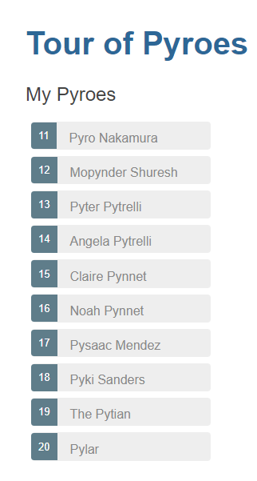
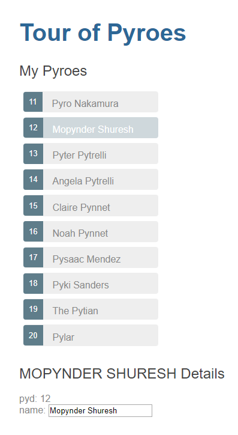
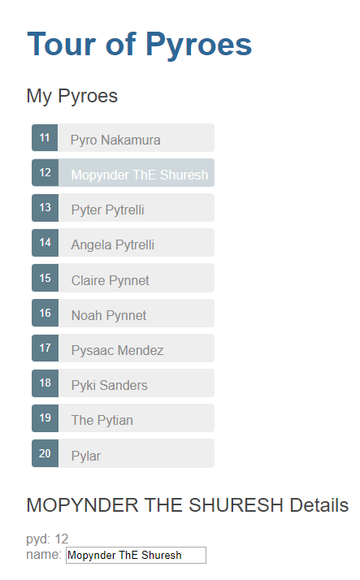

Part 2 - List of Pyroes
***********************

Editing the name of a *Pyro* and having it automatically (or is it
auto-magically?) in other elements is already a great thing. But a single
*Pyro* would probably neither save the plane nor him/herself.

That's why the other *Pyroes* come to the rescue and we need to be able to
display a list with all the names to be able to choose which one will be
edited.

Copy the ``top1`` folder to ``top2`` and enter it. For example, with::

  cp -r top1 top2
  cd top2

.. note:: Under *Windows* and unless you have a proper shell installed
          (*Cygwin*, *MSYS*, *GitBash*, ...) you are probably better off
          using the *Windows Explorer* to make a copy of the directory)

The List of Pyroes
==================

To simplify our approach, we start by adding a ``mock_pyroes.html`` file to our
project layout, where we will be holding our list, which will be acting as a
database.

The file structure and the new database-like Python code look like this.

.. tabs::

   .. code-tab:: bash File Layout

          ├── app
          │   ├── pyroes
          │   │   ├── __init__.py
          │   │   ├── pyroes_component.css
          │   │   ├── pyroes_component.html
          │   │   └── pyroes_component.py
          │   ├── __init__.py
          │   ├── app_component.css
          │   ├── app_component.html
          │   ├── app_component.py
          │   ├── app_module.py
          │   ├── mock_pyroes.py
          │   └── pyro.py
          ├── anpylar.js
          ├── index.html
          ├── package.json
          └── styles.css

   .. code-tab:: python mock_pyroes.py

      from .pyro import Pyro

      Pyroes = [Pyro(**x) for x in [
          {'pyd': 11, 'name': 'Pyro Nakamura'},
          {'pyd': 12, 'name': 'Mopynder Shuresh'},
          {'pyd': 13, 'name': 'Pyter Pytrelli'},
          {'pyd': 14, 'name': 'Angela Pytrelli'},
          {'pyd': 15, 'name': 'Claire Pynnet'},
          {'pyd': 16, 'name': 'Noah Pynnet'},
          {'pyd': 17, 'name': 'Pysaac Mendez'},
          {'pyd': 18, 'name': 'Pyki Sanders'},
          {'pyd': 19, 'name': 'The Pytian'},
          {'pyd': 20, 'name': 'Pylar'}]
      ]

And here the new appearance of the ``PyroesComponent`` parts

.. tabs::

   .. code-tab:: html pyroes_component.html

      <h2>My Pyroes</h2>
      <ul class="pyroes">
      </ul>
      

        <h2 {name}="selected_.name_.map(lambda x: x.upper())">{name} Details</h2>
        
pyd: <txt [selected_.pyd_]>{}</txt>

        

            <label>name:
              <input *_fmtvalue=selected_.name_ placeholder="name"/>
            </label>
        

      

   .. code-tab:: python pyroes_component.py

      from anpylar import Component, html
      from app.pyro import Pyro
      from app.mock_pyroes import Pyroes

      class PyroesComponent(Component):

          bindings = {
              'selected': Pyro(),
          }

          def render(self, node):
              with node.select('ul'):  # find the node where to display the list
                  for pyro in Pyroes:
                      with html.li() as li:  # create a list item per Pyro
                          # if the selected pyro is this pyro ... set a class attr
                          li._class.selected(self.selected_.pyd_ == pyro.pyd)
                          # bind a click to do self.selected_(pyro)
                          li._bindx.click(self.selected_, pyro)
                          # show the pyd in a <apan> as a badge (child of list item)
                          html.span(pyro.pyd, Class='badge')
                          # show the name as text inside the list item
                          html.txt(' {name}')._fmt(name=pyro.name_)

   .. code-tab:: css pyroes_component.css

      /* PyroesComponent's private CSS styles */
      .selected {
        background-color: #CFD8DC !important;
        color: white;
      }
      .pyroes {
        margin: 0 0 2em 0;
        list-style-type: none;
        padding: 0;
        width: 15em;
      }
      .pyroes li {
        cursor: pointer;
        position: relative;
        left: 0;
        background-color: #EEE;
        margin: .5em;
        padding: .3em 0;
        height: 1.6em;
        border-radius: 4px;
      }
      .pyroes li.selected:hover {
        background-color: #BBD8DC !important;
        color: white;
      }
      .pyroes li:hover {
        color: #607D8B;
        background-color: #DDD;
        left: .1em;
      }
      .pyroes .text {
        position: relative;
        top: -3px;
      }
      .pyroes .badge {
        display: inline-block;
        font-size: small;
        color: white;
        padding: 0.8em 0.7em 0 0.7em;
        background-color: #607D8B;
        line-height: 1em;
        position: relative;
        left: -1px;
        top: -4px;
        height: 1.8em;
        margin-right: .8em;
        border-radius: 4px 0 0 4px;

There have been several changes. Let's detail some of them:

  - A stylesheet which is only applicable to the ``PyroesComponent``

  - The HTML code has been extended to:

    - Add the placeholder for the list (a ``<ul>`` element)

    - Embed the editor in a ``
`` which has a ``*_display=...`` directive
      which will controlling when the *div* is shown

    - References in the editor now are to a ``selected_`` observable

  - The Python part>

    - Defines the ``Pyroes`` in ``mock_pyroes.py`` which are imported into the
      component

    - Defines a new binding ``selected`` in ``PyroesComponent`` which is going
      to hold the ``Pyro`` which is selected from the list

      This binding is also used in the HTML code as pointed out above

    - Builds the list inside ``<ul>`` element, by creating as many ``<li>``
      items as ``Pyro`` instances are present in ``Pyroes``

Let's examine things.

.. rubric:: The list

.. code-block:: html

    <h2>My Pyroes</h2>
    <ul class="pyroes">
    </ul>

The ``<ul>`` (unordered list) from the html content will serve as the container
for the list.

.. code-block:: python

    with node.select('ul'):  # find the node where to display the list
        for pyro in Pyroes:
            with html.li() as li:  # create a list item per Pyro
                # if the selected pyro is this pyro ... set a class attr
                li._class.selected(self.selected_.pyd_ == pyro.pyd)
                # bind a click to do self.selected_(pyro)
                li._bindx.click(self.selected_, pyro)
                # show the pyd in a <apan> as a badge (child of list item)
                html.span(pyro.pyd, Class='badge')
                # show the name as text inside the list item
                html.txt(' {name}')._fmt(name=pyro.name_)

After selecting the element ``<ul>``, a simple loop allows us to create the
list. Let's look at how observables are used:

  - ``li._class.selected(self.selected_.pyd_ == pyro.pyd)``

    A *list item* (``<li>``) will switch on the ``selected`` attibute inside
    the ``class`` if the ``pyd`` of the selected *Pyro* corresponds to the
    ``pyd`` of the *Pyro* during the loop (``self.selected_.pyd_ ==
    pyro.pyd``)

    Let's concentrate on the ``self.selected_.pyd_`` syntax. This says:

      - Create an observable that will observe ``pyd`` inside ``selected`` even
        if the value referenced by ``selected`` changes.

    And that's what we want, because the value referenced by ``selected`` will
    change when clicking on it.

    If we had written it as ``self.selected.pyd_``, we would then have an
    observable to the current value of ``pyd`` in ``selected``. It wouldn't
    track the changes to ``selected``, but to the current underlying ``pyd``.

  - ``li._bindx.click(self.selected_, pyro)``

    The *list item* click even is bound to call ``self.selected_`` with a value
    of ``pyro`` (the corresponding one during the loop)

    ``_bindx`` is specifically not named ``_bind`` to indicate that **NO**
    event is going to be delivered to the callback.

    Should you want to receive the *event* in the callback, use: ``_bind``

    Recall from the previous part of the tour, that: *Observables* created in
    the ``bindings`` attribute are also callables. And that calling them with a
    value will set the value in the attribute they are observing. When the
    element fires a click event the following will happen

    .. code-block:: python

       self.selected_(pyro)

    which is functionally equivalent to:

    .. code-block:: python

       self.selected = pyro

    Even if not obvious from the example this has an advantage when using the
    *Obervsable* attribute in ``lambda`` expresisons.

    This is valid Python code

    .. code-block:: python

       lambda pyro: self.selected_(pyro)

    But this isn't:

    .. code-block:: python

       lambda pyro: self.selected = pyro

.. rubric:: The editor

The 2nd part of the html content manages the editor with no need for Python
code in the component.

.. code-block:: html

      

        <h2 {name}="selected_.name_.map(lambda x: x.upper())">{name} Details</h2>
        
pyd: <txt [selected_.pyd_]>{}</txt>

        

            <label>name:
              <input *_fmtvalue=selected_.name_ placeholder="name"/>
            </label>
        

      

All references now are to the observable ``selected_`` and because we know that
is going to hold a ``Pyro``, to the observables inside each instance (namely:
``name_`` and ``pyd_``)

There is one novelty::

      

This would be like executing this code in Python::

  with html.div() as d:
      d._display(self.selected_.pyd_)  # display if selected.pyd evaluates to True

The observable ``self.selected_.pyd_`` is being used as a boolean. If the
underlying ``pyd`` is ``0`` the editor will not be displayed. Anything
else will evaluate to ``True`` and the internals of ``_display`` will make
the ``d`` element visible.

Let's execute
-------------
::

  anpylar-serve top2

And go the browser

  http://127.0.0.1:2222

And our list of *Pyroes* will be displayed

Clicking on one of the Pyroes will:

  - Open the editor

  - Change the *class* of the selected *Pyro* so that it becomes highlighted

And making changes in the editor is automatically reflected not only in the
``input`` field, but also in the uppercased name in the editor and in the list
of *Pyroes*

Notes
=====

This example already shows how to mix and match the canonical ways to implement
components in *AnPyLar*

  - As much as possible has been made in the *HTML* definition

  - But a ``for`` loop is managed in the Python part of the component, as it
    does a lot more sense than scattering parts of the loop here and there and
    having special markers to decide when a loop is over and which things
    belong to the loop and which ones to the scope of the component (``self``)
