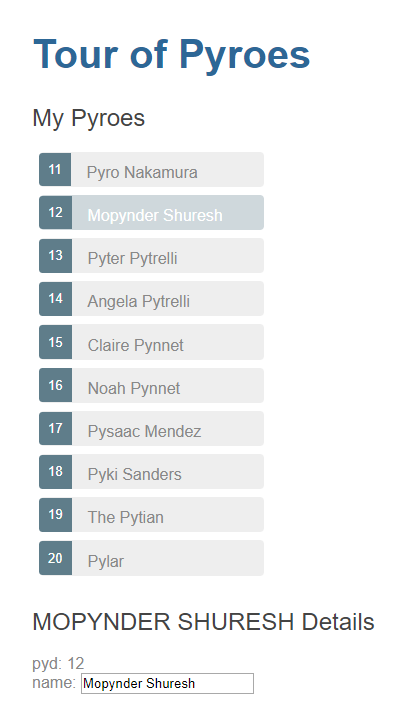

Part 4 - Service Providers
**************************

Listing *Pyroes* and editing them is fine and good, but at the moment the
application is completely isolated from the world: the *Pyroes* are defined
within the application itself.

Being all this about web development, and thus: *Networking*, it would be good
if we could actually fetch the *Pyroes* from a server.

Although that would be ideal, we'll start by creating a fake service which will
give us the *Pyroes*, just like if we had connected to the network. This will
serve as another cornerstone before carrying on.

Copy the ``top3`` folder to ``top4`` and enter it. For example, with::

  cp -r top3 top4
  cd top4

.. note:: Under *Windows* and unless you have a proper shell installed
          (*Cygwin*, *MSYS*, *GitBash*, ...) you are probably better off
          using the *Windows Explorer* to make a copy of the directory)

Adding a ``PyroService``
========================

A service in *AnPyLar* has no specific requirements: the attributes and API
(*methods*) are for the end user to define.

.. note:: A ``Service`` base class might be implemented in the future giving
          services certain default properties, like parent-child
          relationships, but this is not foreseen at the moment.

Let's place a ``PyroService`` simply inside a ``pyro_service.py`` module
(remember that we like consistent naming conventions)

The project layout now

.. tabs::

   .. code-tab:: bash Layout

      ├── app
      │   ├── pyro_detail
      │   │   ├── __init__.py
      │   │   ├── pyro_detail_component.css
      │   │   ├── pyro_detail_component.html
      │   │   └── pyro_detail_component.py
      │   ├── pyroes
      │   │   ├── __init__.py
      │   │   ├── pyroes_component.css
      │   │   ├── pyroes_component.html
      │   │   └── pyroes_component.py
      │   ├── __init__.py
      │   ├── app_component.css
      │   ├── app_component.html
      │   ├── app_component.py
      │   ├── app_module.py
      │   ├── mock_pyroes.py
      │   ├── pyro.py
      │   └── pyro_service.py
      ├── anpylar.js
      ├── index.html
      ├── package.json
      └── styles.css

We keep ``mock_pyroes.py`` in place with the definition of our *Pyroes*,
because the service will at this point in time source the data from it.

The service and its placement
=============================

.. tabs::

   .. code-tab:: python pyro_service.py

      from anpylar import Observable

      from .mock_pyroes import Pyroes

      class PyroService:

          def get_pyroes(self):
              return Observable.of(Pyroes)

   .. code-tab:: python app_module.py

      from anpylar import Module

      from .app_component import AppComponent
      from .pyro_service import PyroService

      class AppModule(Module):

          components = AppComponent

          bindings = {}

          services = {
              'pyro_service': PyroService,
          }

          routes = {}

          def __init__(self):
              pass

   .. code-tab:: python pyroes_component.py

      from anpylar import Component, html
      from app.pyro import Pyro

      class PyroesComponent(Component):

          bindings = {
              'selected': Pyro(),
              'pyroes': [],  # observable for receiving pyroes
          }

          def __init__(self):
              # get the pyroes from service into the observable
              self.pyro_service.get_pyroes().subscribe(self.pyroes_)

          def render(self, node):
              with node.select('ul') as ul:  # find node where to display the list
                  # Render under "ul" using
                  #   callback: render_pyroes
                  #   when: the observable self.pyroes_ is signaled
                  ul._render(self.render_pyroes, self.pyroes_)

          def render_pyroes(self, pyroes):
              # Because this was registered with ul._render, any rendering action
              # takes place under ul, which is empty when entering here
              for pyro in pyroes:
                  with html.li() as li:  # create a list item per Pyro
                      # if the selected pyro is this pyro ... set a class attr
                      li._class.selected(self.selected_.pyd_ == pyro.pyd)
                      # bind a click to do self.selected_(pyro)
                      li._bindx.click(self.selected_, pyro)
                      # show the pyd in a <apan> as a badge (child of list item)
                      html.span(pyro.pyd, Class='badge')
                      # show the name as text inside the list item
                      html.txt(' {name}')._fmt(name=pyro.name_)

Defining the service and setting it in motion hasn't actually taken that much:

  - The service in ``pyro_service.py`` is a simple class with a single method,
    which returns an *Observable* made ``of`` the *Pyroes* that we have in
    ``mock_pyroes.py``

    The source could have been anything else. The important part here is that
    the return value that will be expected is an *Observable*, i.e.: callers
    will be able to subscribe to it

  - Getting it up and running means simply adding it to the ``services``
    directive (a *dictionary*) in the application module ``AppModule``.

    .. code-block:: python

          services = {
              'pyro_service': PyroService,
          }

    This will make the service available to any component (and its
    subcomponents) as an attribute ``self.pyro_service``

With that knowledge in mind, we have also modified our ``PyroesComponent``
code:

  - A new binding called ``pyroes`` is added, which will receive the *Pyroes*
    from the service

    .. code-block:: python

          bindings = {
              'selected': Pyro(),
              'pyroes': [],  # observable for receiving pyroes
          }

  - The observable for the *Pyroes* is fetched from the service during
    ``__init__``. Each event generated by the observable will be sent to
    ``self.pyroes_`` which is itself an observable (actually more a *Subject*).
    The reason is that even in this example we assume that the service could be
    contacting the network, i.e.: we don't know when the result will be
    delivered.

    Observables in *AnPyLar* are also callables and that's why we can pass
    ``self.pyroes_`` as the subscriptor.

    .. code-block:: python

          def __init__(self):
              # get the pyroes from service into the observable
              self.pyro_service.get_pyroes().subscribe(self.pyroes_)

  - In ``render`` and instead of rendering, we tell the node ``<ul>`` to
    delegate rendering (with the supercharged method ``_render``) to the method
    ``self.render_pyroes`` whenever the *Observable* ``self.pyroes_`` has
    something to observe.

    .. code-block:: python

       def render(self, node):
           with node.select('ul') as ul:  # find node where to display the list
               # Render under "ul" using
               #   callback: render_pyroes
               #   when: the observable self.pyroes_ is signaled
               ul._render(self.render_pyroes, self.pyroes_)

Effectively:

  - The code to generate the render on-screen list is the same as before

  - The code has been moved to method which is asynchronously invoked when
    ``self.pyroes`` is set via its associated observable ``self.pyroes_``

  - Asynchronous being the key, because it is unknown when the service will
    deliver the *Pyroes*

.. note:: As indicated above, in this example the *Pyroes* are still simply
          being gotten from a list, but now we have prepared the app for
          **more**

Let's execute
-------------

We haven't changed the functionality, simply how we distribute the
functionality across components. The results are the same as in the previous
examples.
::

  anpylar-serve top4

And go the browser

  http://127.0.0.1:2222

And our list of *Pyroes* will be displayed

.. image:: top4-00.png

Clicking on one of the Pyroes will:

  - Open the editor

  - Change the *class* of the selected *Pyro* so that it becomes highlighted

And making changes in the editor is automatically reflected not only in the
``input`` field, but also in the uppercased name in the editor and in the list
of *Pyroes*

