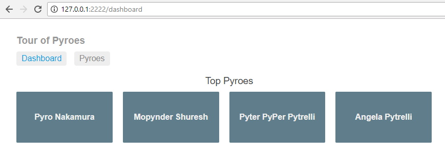

Part 5 - Navigation
*******************

Our *Pyroes* on Tour have already achieved a lot, but there is a drawback: *we
have a static set of components*.

Even if we can dynamically show components, change classes and we could even
think of re-rendering a component to be something different, the reality is
that we are constrained to the layout we have pre-defined.

In order to overcome this limitation, we need to use **routing**. The concept
is easy:

  - The route (i.e.: the url) will define which components will render
    on-screen

  - A *route-outlet* will indicate where the rendering has to happen

Copy the ``top4`` folder to ``top5`` and enter it. For example, with::

  cp -r top4 top5
  cd top5

.. note:: Under *Windows* and unless you have a proper shell installed
          (*Cygwin*, *MSYS*, *GitBash*, ...) you are probably better off
          using the *Windows Explorer* to make a copy of the directory)

For the concept there will be:

  - A navigation bar in our application (``AppComponent``)

  - A ``DashboardComponent`` which will be, so to say, the landing page after
    our application has been instantiated

And the known components

  - Our ``PyroesComponent`` which displays the list of *Pyroes*

  - Our ``PyroDetailComponent`` which allows us to edit the name of a
    *Pyro*. Because this is already a separate component, it can also be served
    in a different route.

Our final layout will look like this

The project layout now

.. tabs::

   .. code-tab:: bash Layout

      ├── app
      │   ├── dashboard
      │   │   ├── __init__.py
      │   │   ├── dashboard_component.css
      │   │   ├── dashboard_component.html
      │   │   └── dashboard_component.py
      │   ├── pyro_detail
      │   │   ├── __init__.py
      │   │   ├── pyro_detail_component.css
      │   │   ├── pyro_detail_component.html
      │   │   └── pyro_detail_component.py
      │   ├── pyroes
      │   │   ├── __init__.py
      │   │   ├── pyroes_component.css
      │   │   ├── pyroes_component.html
      │   │   └── pyroes_component.py
      │   ├── __init__.py
      │   ├── app_component.css
      │   ├── app_component.html
      │   ├── app_component.py
      │   ├── app_module.py
      │   ├── app_routing.py
      │   ├── mock_pyroes.py
      │   ├── pyro.py
      │   └── pyro_service.py
      ├── anpylar.js
      ├── index.html
      ├── package.json
      └── styles.css

Notice that we will be adding:

  - A ``dashboard`` directory for the ``DashboardComponent``

  - An ``app_routing.py`` module holding the definition of the routes


Before we define the routes, let's define (or re-define) the different
components. Let's start with the ``AppComponent``


.. tabs::

   .. code-tab:: html app_component.html

      <h1>{title}</h1>
      <nav>
        <a routerLink="/dashboard" routerLinkActive="active">Dashboard</a>
        <a routerLink="/pyroes" routerLinkActive="active">Pyroes</a>
      </nav>
      <router-outlet></router-outlet>


   .. code-tab:: python app_component.py

      from anpylar import Component, html


      class AppComponent(Component):

          title = 'Tour of Pyroes'

          bindings = {
              'pyroes': [],
          }

          def __init__(self):
              self.pyro_service.get_pyroes().subscribe(self.pyroes_)


The ``AppComponent``
--------------------

Our ``AppComponent`` has already undergone several changes.

The html content has:

  - A ``<nav>`` structure with two anchors ``<a routerLink=...>`` defining the
    master navigation. The ``routerLinkActive`` is there to signal if the links
    have to be styled when the corresponding path is active

  - A ``<router-outlet>`` tag
    Here is where the outcome of the routing will be deployed.

The Python part:

  - Has a ``pyroes = []`` binding. This was previously in our
    ``PyroesComponent`` which was always active. But this will no longer be the
    case. ``AppComponent`` on the other hand, being the bootstrap component, is
    always active and can offer the binding to children components.

  - Kickstarts fetching the *Pyroes* from the service (remember the service is
    defined in ``AppModule``, which will be shown later in this example) This
    was also in ``PyroesComponent`` before and has been moved over here for the
    same reasons as the binding.

  - Has lost the import of the different subcomponents. This is because the
    components are now routing-dependent and the import has to be taken care of
    when designing the routing.


The ``PyroesComponent``
-----------------------

Our ``PyroesComponent`` has also to slightly change to accommodate the fact
that:

  - It is no longer the parent of the ``PyroDetailComponent``

  - It will simply ask the routing engine to go a route (which will of course
    use the right component) for edition


.. tabs::

   .. code-tab:: html pyroes_component.html

      <h2>My Pyroes</h2>
      <ul class="pyroes">
      </ul>

   .. code-tab:: python pyroes_component.py

      from anpylar import Component, html


      class PyroesComponent(Component):

          def render(self, node):
              # render under ul in render_pyroes when observable self.pyroes_ fires
              with node.select('ul') as ul:  # find node where to display the list
                  ul._render(self.render_pyroes, self.pyroes_)

          def render_pyroes(self, pyroes):
              for pyro in pyroes:
                  with html.li() as li:  # per-pyro list item
                      # per-pyro anchor routing path with parameter pyd
                      with html.a(routerlink=('/detail', {'pyd': pyro.pyd})):
                          html.span(pyro.pyd, Class='badge')  # show pyd as badge
                          html.txt(' {name}')._fmt(name=pyro.name_)  # obs name_


The Html part:

  - Has lost the tag ``<pyro-detail>``. This component no longer produces the
    instantiation of a subcomponent. It will route to somwewhere

The Python part:

  - Has no imports for *Pyro* or anything else related to the app. It is rather
    generic. There is obviously knowledge about which attributes the received
    data has ( ``pyd`` and ``name`` per *pyro*)

  - Has lost the bindings ``selected`` and ``pyroes``. Remember they have been
    moved to ``AppComponent`` which is active the entire time and controls the
    ``<router-outlet>`` (where this component will be displayed)

  - It doesn't init the ``pyro_service``, which is also done in ``AppComponent``

  - Uses the binding ``self.pyroes_``, which will be sought in the parent,
    being the parent the component controlling the ``<router-outlet>``


  - Generates a ``<a routerlink=('/detail', {'pyd': pyro.pyd})>`` linnk per
    received *Pyro*
    As it should be obvious from the syntax:

      - ``/detail`` is the destination path
      - ``{'pyd': pyro.pyd}`` is a dict contanining the named arguments (query
        string) for the destination path (i.e.: component that will receive it)


The ``PyroDetailComponent``
---------------------------

As we have just seen ... there will be named arguments coming to this
component. It will obviously need some adaptations. Let's see the changes

.. tabs::

   .. code-tab:: html pyro_detail_component.html

      <div *_display=pyro_.pyd_>
        <h2 {name}="pyro_.name_.map(lambda x: x.upper())">{name} Details</h2>
        <div><span>pyd: </span><txt [pyro_.pyd_]>{}</txt></div>
        <div>
            <label>name:
              <input *_fmtvalue=pyro_.name_ placeholder="name"/>
            </label>
        </div>
        <p />
        <button (click)=router.back()>Go back</button>
      </div>

   .. code-tab:: python pyro_detail_component.py

      from anpylar import Component, html

      from app.pyro import Pyro


      class PyroDetailComponent(Component):
          bindings = {
              'pyro': Pyro(),
          }

          def loading(self):
              self.pyro_service \
                  .get_pyro(self.params.get('pyd', 0)) \
                  .subscribe(self.pyro_)  # fetch async and fire self.pyro_ when done

          def unloading(self):
              self.pyro = Pyro()  # clear the editor on unloading: set null Pyro

          def render(self, node):
              pass  # the entire work is done in the html rendering

Our Html code:

  - Has replaced the references to the ``selected`` binding with references to
    the ``pyro`` binding. Just a matter of indicating that the component is
    acting without relation to other's selection.
    It will display and edit a *Pyro*

  - Has a ``<button (click)=router.back()>`` which should be almost
    self-explanatory.

    - This creates a button, binds to the ``click`` event which will fire
      ``self.router.back()``

    .. note:: ``self.router.back()`` could be seen as an install call and not
              as a call which has to be fired when the event happens.

              You can also say::

                <button (click)=router.back>

              The machinery in *AnPyLar* will look for an ending parenthesis to
              detect this behavior and avoid making a call instead of a binding.

The important part here: the component has direct access to the routing engine
with ``self.router``. There is **no** need to import anything and say anything
special. The facility is there.

The Python code:

  - Uses the ``loading`` and ``unloading`` methods. These are fired when the
    component is being loaded and unloaded from the DOM. Rather than
    recreating/destroying the component, what would be very expensive, the
    component is cached and given the chance to execute actions with each
    event.

    - Upon loading: it calls the *pyro_service* asking for an individual *Pyro*
      based on ``self.params.get('pyd', 0)``

      .. note:: we'll see the modifications to the service later in the doc.

      **Remember**: The ``PyroesComponent`` had links with::

                      with html.a(routerlink=('/detail', {'pyd': pyro.pyd})):

      And as we pointed out above: ```pyd`` would be a named param for the
      receiving component. As seen there, this can be accessed with
      ``self.params`` which acts like a standard dictionary.

      .. note:: ``self.params`` is an alias to ``self.route.params`` where
                ``self.route`` is an object containing information about the
                current route which navigated down to this component.

    - Upon unloading: it sets the ``pyro`` to a null *Pyro* (``pyd = 0``) to
      clear the editor

    - There is no need to ``render`` anything, because all is done in the Html
      code


The ``DashboardComponent``
--------------------------

Having seen how the existing components have been modified, it's time for the
new component. Just as before, we can easily generate the skeleton with (inside
the ``app`` directory)::

  anpylar-component Dashboard

And we put some content in the generated files

.. tabs::

   .. code-tab:: html dashboard_component.html

      <h3>Top Pyroes</h3>
      <div class="grid grid-pad">
      </div>

   .. code-tab:: python dashboard_component.html

      from anpylar import Component, html


      class DashboardComponent(Component):

          def render(self, node):
              with node.select('div') as d:
                  d._render(self.render_top_pyroes, self.pyroes_)

          def render_top_pyroes(self, pyroes):
              for p in pyroes[:4]:
                  with html.a(Class='col-1-4',
                              routerlink=('/detail', {'pyd': p.pyd})):

                      with html.div(Class='module pyro'):
                          html.h4('{name}')._fmt(name=p.name_)

   .. code-tab:: css dashboard_component.css

      /* DashboardComponent's private CSS styles */
      [class*='col-'] {
        float: left;
        padding-right: 20px;
        padding-bottom: 20px;
      }
      [class*='col-']:last-of-type {
        padding-right: 0;
      }
      a {
        text-decoration: none;
      }
      *, *:after, *:before {
        -webkit-box-sizing: border-box;
        -moz-box-sizing: border-box;
        box-sizing: border-box;
      }
      h3 {
        text-align: center; margin-bottom: 0;
      }
      h4 {
        position: relative;
      }
      .grid {
        margin: 0;
      }
      .col-1-4 {
        width: 25%;
      }
      .module {
        padding: 20px;
        text-align: center;
        color: #eee;
        max-height: 120px;
        min-width: 120px;
        background-color: #607D8B;
        border-radius: 2px;
      }
      .module:hover {
        background-color: #EEE;
        cursor: pointer;
        color: #607d8b;
      }
      .grid-pad {
        padding: 10px 0;
      }
      .grid-pad > [class*='col-']:last-of-type {
        padding-right: 20px;
      }
      @media (max-width: 600px) {
        .module {
          font-size: 10px;
          max-height: 75px; }
      }
      @media (max-width: 1024px) {
        .grid {
          margin: 0;
        }
        .module {
          min-width: 60px;
        }
      }


The Html part is pretty dull, just a placeholder for the rendering that will be
done in the Python part, which

   .. code-tab:: python dashboard_component.html

      from anpylar import Component, html


      class DashboardComponent(Component):

          def render(self, node):
              with node.select('div') as d:
                  d._render(self.render_top_pyroes, self.pyroes_)

          def render_top_pyroes(self, pyroes):
              for p in pyroes[:4]:
                  with html.a(Class='col-1-4',
                              routerlink=('/detail', {'pyd': p.pyd})):

                      with html.div(Class='module pyro'):
                          html.h4('{name}')._fmt(name=p.name_)

  - Piggybacks on the observable ``self.pyroes_`` (remember it's defined in
    ``AppComponent`` which is the owner of the ``<router-outlet>``)

  - Renders the top 4 *Pyroes* and creates a link with an ``<a
    routerlink=...>`` tag. Just like the ``PyroesComponent`` does, including
    the named argument for the routing: ``{'pyd': p.pyd}``


The Routing
-----------

Done with the components. But this is about the routing and time to see it. The
routing is declared in the main module of the applicaiton: ``AppModule`` in the
``routes`` directive. But to keep things clean and tidy will be declaring it in
a separate module and importing it.


.. tabs::

   .. code-tab:: python app_module.py

      from anpylar import Module

      from .app_component import AppComponent
      from .app_routing import AppRouting
      from .pyro_service import PyroService


      class AppModule(Module):

          components = AppComponent

          bindings = {}

          services = {
              'pyro_service': PyroService,
          }

          routes = AppRouting


          def __init__(self):
              pass

   .. code-tab:: python app_routing.py

      from .dashboard import DashboardComponent
      from .pyro_detail import PyroDetailComponent
      from .pyroes import PyroesComponent


      AppRouting = [
          {
              'path': '',
              'redirect_to': '/dashboard',
              'path_match': 'full'
          },
          {
              'path': 'dashboard',
              'component': DashboardComponent
          },
          {
              'path': 'pyroes',
              'component': PyroesComponent
          },
          {
              'path': 'detail',
              'component': PyroDetailComponent,
              'params': {'pyd': int},  # param transformation function
          },
      ]


   .. code-tab:: python pyro_service.py

      from anpylar import Observable

      from .mock_pyroes import Pyroes


      class PyroService:

          def get_pyroes(self):
              return Observable.of(Pyroes)

          def get_pyro(self, pyd):
              return Observable.from_(Pyroes).filter(lambda pyro: pyro.pyd == pyd)


Our ``app_module.py`` import ``AppRouting`` from ``app_routing.py`` and sets it
as the value for the routing::

  ...

  routes = AppRouting

  ...

As you may see above, the routes is list (or iterable) of dictionary
entries. Let's try to break the mystery:

.. code-block:: python

          {
              'path': '',
              'redirect_to': '/dashboard',
              'path_match': 'full'
          },


If nothing else remains to be matched ``path: ''`` redirect to
``/dashboard``. This is the default for the entry path. ``path_match: 'full'``
ensures that the matching of ``path`` is against the full url and not a
remaining url (which could be the case for children routes, which are not in
play here)

.. code-block:: python

          {
              'path': 'dashboard',
              'component': DashboardComponent
          },

This says that when the remaining url to be match is ``dashboard``, the
component to be put in play in the ``<router-outlet>`` is:
``Dashboardcomponent``.

The next entry does the same for ``pyroes`` and ``PyroesComponent``

And last but not least is the entry for the *Pyro* editor.

.. code-block:: python

          {
              'path': 'detail',
              'component': PyroDetailComponent,
              'params': {'pyd': int},  # param transformation function
          },

This one includes a ``params`` entry and a dictionary which declares the name
of the param to be ``pyd`` and which transformation function has to be applied
when the query string is read from the url (in this case: ``string will be
converted to int`` ... if possible)

Transforming ensures consistency, be it because of internal routing (an ``int``
is probably specified by other components) or because of a pasted
url in the browser (which is for sure text at the beginning)

Let's not forget the **pyro_service**. Remember that the editor was using a new
method named: ``pyro_service.get_pyro(pyd=xxx)``. From above:

.. code-block:: python

          def get_pyro(self, pyd):
              return Observable.from_(Pyroes).filter(lambda pyro: pyro.pyd == pyd)

Just like ``get_pyroes`` returns an Observable, so does ``get_pyro``, which
filters the ``Pyroes`` (recall they are a mock database) for the sought ``pyd``


Let's execute
=============

With all that in place, we can go for it::

  anpylar-serve top4

And go the browser

  http://127.0.0.1:2222

The application has recognized our intent to go to the homepage and as
indicated in the routing ... it has taken us to the ``/dashboard`` route and
with it to the ``DashboardComponent``

Notice also in the picture how the ``Dashboard`` navigation button is
highlighted. Recall that this is because we specified ``routerLinkActive``


If we click on ``Pyroes``, we are taking to the familiar list of *Pyroes* and
the url in the browser changes to ``/pyroes``


Hitting the **browser's back arrow** takes us back to the ``Dashboard`` and the
**forward arrow** takes us again to the ``Pyroes`` part. All within
application, not needed to go the network.

From either the ``Dashboard`` or ``Pyroes`` just click on the name of a
``Pyro`` and let yourself be taken to the editor.

.. image:: top5-pyrodetail.png

Notice that neither ``Dashboard`` nor ``Pyroes`` in the navigation buttons are
highlighted. And that's because the current route is neither of those.

And:

  - The route contains the parameter which identifies our *Pyro*::

      http://127.0.0.1:2222/detail;pyd=13

    That's how the component knows which *Pyro* has to be edited.

    .. note:: The *AnPyLar* Simple Server supports direct pasting of such
              URLs. Try pasting: http://127.0.0.1:2222/detail;pyd=15

              Of course, in a real-life environment, things like authorization,
              existence of the ``pyd`` and many other things would need to be
              checked.

Make some changes to the name ...


And then choose your path:

  - Click ``Go Back``

  - Use the browser's back button

  - Click either of the navigation links: ``Dashboard`` or ``Pyroes``

Simply play with the navigation. Here we'll click on ``Go Back`` and go back to
the ``Dashboard`` where the editions are already taken into account




That's all ... it's about time to go to the network ... in the next chapter.
