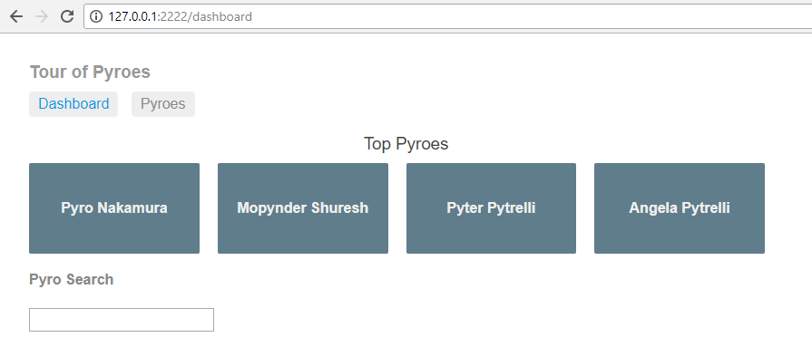
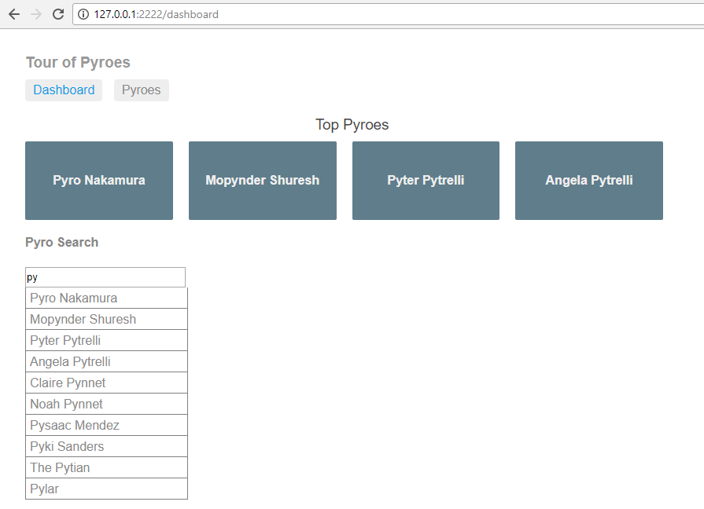
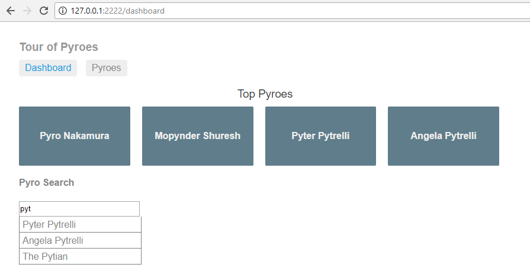
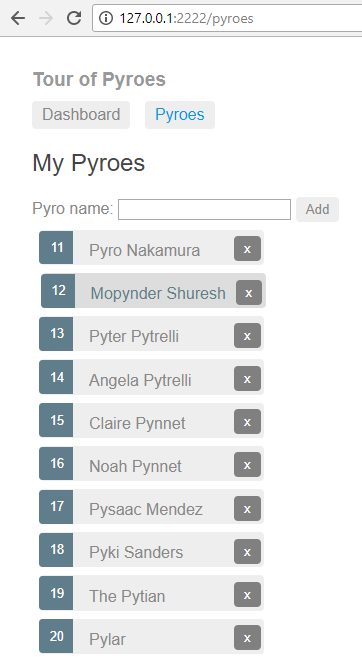
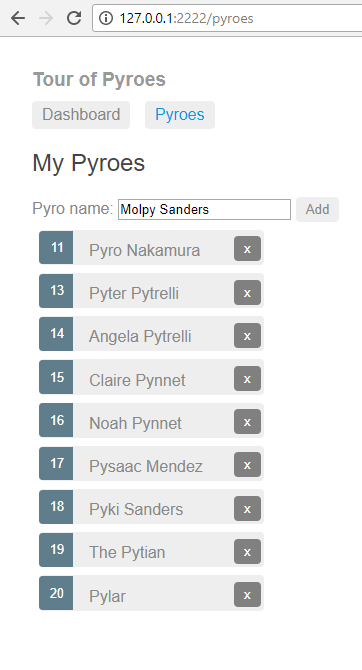
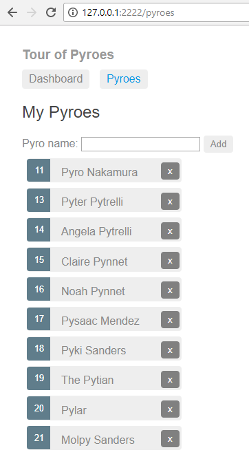
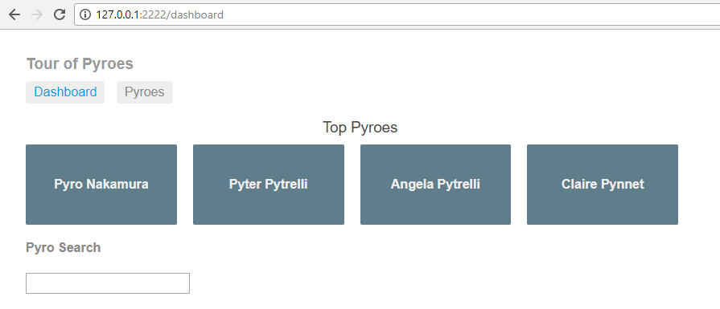
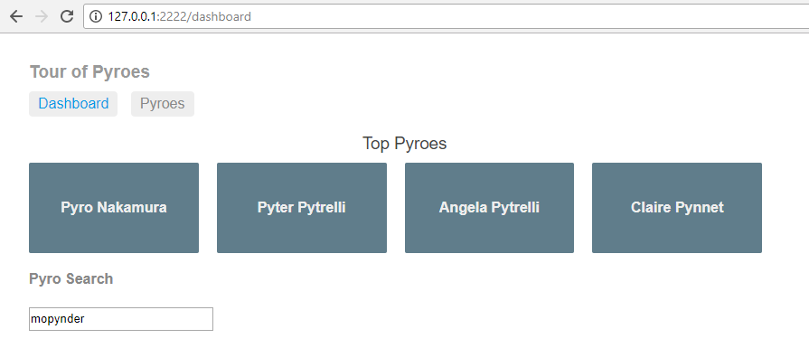
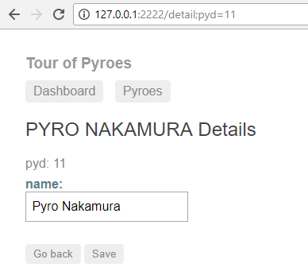

Part 6 - Networking: http
*************************

Let's go for the next step.

Copy the ``top5`` folder to ``top6`` and enter it. For example, with::

  cp -r top5 top6
  cd top6

.. note:: Under *Windows* and unless you have a proper shell installed
          (*Cygwin*, *MSYS*, *GitBash*, ...) you are probably better off
          using the *Windows Explorer* to make a copy of the directory)

The application is growing, but so far the *Pyroes* have been sourced directly
from a list of objects. A real life web application would fetch the information
from the network. And that's why we are also going to do it ... virtually.

*AnPyLar* includes an *Http* client which can fetch data from the network using
*ajax*, but can also deliver data from local sources. To avoid having to set up
a server with an API, we'll start by using the local sourcing facility.

The additions to this:

  - Adding / Editing / Deleting Pyroes (Editing was the only operation
    previously supported)

  - Searching for *Pyroes*

  - Doing it all with the *Http* client

After we are done, the final layout will look like this

.. tabs::

   .. code-tab:: bash Layout

      ├── app
      │   ├── dashboard
      │   │   ├── __init__.py
      │   │   ├── dashboard_component.css
      │   │   ├── dashboard_component.html
      │   │   └── dashboard_component.py
      │   ├── pyro_detail
      │   │   ├── __init__.py
      │   │   ├── pyro_detail_component.css
      │   │   ├── pyro_detail_component.html
      │   │   └── pyro_detail_component.py
      │   ├── pyro_search
      │   │   ├── __init__.py
      │   │   ├── pyro_search_component.css
      │   │   ├── pyro_search_component.html
      │   │   └── pyro_search_component.py
      │   ├── pyroes
      │   │   ├── __init__.py
      │   │   ├── pyroes_component.css
      │   │   ├── pyroes_component.html
      │   │   └── pyroes_component.py
      │   ├── __init__.py
      │   ├── app_component.css
      │   ├── app_component.html
      │   ├── app_component.py
      │   ├── app_module.py
      │   ├── app_routing.py
      │   ├── mock_pyroes.py
      │   ├── pyro.py
      │   ├── pyro_search_service.py
      │   └── pyro_service.py
      ├── anpylar.js
      ├── index.html
      ├── package.json
      └── styles.css

Notice that we will be adding:

  - A ``pyro_search`` directory for the ``PyroSearchComponent``

  - A ``pyro_search_service.py`` for the ``PyroSearchService``

The top-level changes
---------------------

Let's first see the modification made at the top level to accomodate change

.. tabs::

   .. code-tab:: python mock_pyroes.py

      Pyroes = [
          {'pyd': 11, 'name': 'Pyro Nakamura'},
          {'pyd': 12, 'name': 'Mopynder Shuresh'},
          {'pyd': 13, 'name': 'Pyter Pytrelli'},
          {'pyd': 14, 'name': 'Angela Pytrelli'},
          {'pyd': 15, 'name': 'Claire Pynnet'},
          {'pyd': 16, 'name': 'Noah Pynnet'},
          {'pyd': 17, 'name': 'Pysaac Mendez'},
          {'pyd': 18, 'name': 'Pyki Sanders'},
          {'pyd': 19, 'name': 'The Pytian'},
          {'pyd': 20, 'name': 'Pylar'},
      ]

   .. code-tab:: python app_module.py

      from anpylar import Module, Http

      from .app_component import AppComponent
      from .app_routing import AppRouting
      from .pyro_service import PyroService
      from .pyro_search import PyroSearchComponent
      from .pyro_search_service import PyroSearchService

      if True:
          from .mock_pyroes import Pyroes
          Http.serve(Pyroes, index='pyd', url='api/pyroes/')

      class AppModule(Module):

          components = AppComponent

          bindings = {}

          services = {
              'pyro_service': PyroService,
              'pyro_search': PyroSearchService,
          }

          routes = AppRouting

          def __init__(self):
              pass

The ``Pyroes`` in *mock_pyroes.py* are no longer *Pyro* instances. The
structure is an iterable of *dict* entries. And this is so to reflect data that would
flow from the network (because the translation to/from *Json* is
straightforward) and somehow the structure of database.

In *app_module.py* we do:

  - Import ``PyroSearchComponent``. This is to make it usable in our
    ``DashboardComponent``, because the *pyro_search* is part of no route (we
    could have of course imported in the package defining our
    ``DashboardComponent``. Do it so if you prefer.

  - Declare the ``PyroSearchService`` in the ``services`` directive, so that it
    will be started for us

  - And fake the network service with

    .. code-block:: python

       if True:
           from .mock_pyroes import Pyroes
           Http.serve(Pyroes, index='pyd', url='api/pyroes/')

    The ``Http`` client in *AnPyLar* can accept an iterable of *dict* entries
    (you tell it what the key is for sorting purposes) and hijack requests that
    are directed to specicic routes. In our case: ``url='api/pyroes'``. There
    will be a basic *CRUD* interface mapped to the *POST / GET / PUT / DELETE*
    http methods.

With that in hand we can have a look at the changes/additions to the services.

The Services
------------

.. tabs::

   .. code-tab:: python pyro_service.py

      from anpylar import Observable, http

      from .pyro import Pyro

      import json

      class PyroService:

          def __init__(self):
              self.http = http.Http(
                  url='api/pyroes/',
                  headers={'Content-Type': 'application/json'},
              )

          def handle_error(self, e, retval=False):
              print(e)
              return retval

          def get_pyroes(self):
              return self.http.get() \
                  .map(lambda x: [Pyro(**p), for p in json.loads(x)]) \
                  .catch_exception(lambda e: self.handle_error(e, []))

          def get_pyro(self, pyd):
              return self.http.get(url='{}'.format(pyd)) \
                  .map(lambda x: Pyro(**json.loads(x))) \
                  .catch_exception(lambda e: self.handle_error(e, Pyro()))

          def update_pyro(self, pyro):
              return self.http.put(url='{}'.format(pyro.pyd),
                                   data=json.dumps({'name': pyro.name})) \
                  .catch_exception(lambda e: self.handle_error(e))

          def delete_pyro(self, pyd):
              return self.http.delete(url='{}'.format(pyd)) \
                  .catch_exception(lambda e: self.handle_error(e))

          def add_pyro(self, name):
              return self.http.post(data=json.dumps({'name': name})) \
                  .map(lambda x: Pyro(**json.loads(x))) \
                  .catch_exception(lambda e: self.handle_error(e))

   .. code-tab:: python pyro_search_service.py

      from anpylar import http, Observable

      from .pyro import Pyro

      import json

      class PyroSearchService:
          def __init__(self):
              self.http = http.Http(
                  url='api/pyroes/',
                  headers={'Content-Type': 'application/json'},
              )

          def search(self, term):
              return self.http.get(data={'name': term}) \
                  .map(lambda x: [Pyro(**p), for p in json.loads(x)])

Our ``PyroService`` has grown quite a bit, but it is still generic. It uses the
``Http`` client to issue the aforementioned *POST / GET / PUT / DELETE* calls
in order to implement the CRUD interface.

The new ``PyroSearchService`` is also modelled as an *Observable* and simply
retrieves the *Pyroes* which match the search criterion (which is simply to
contain the sought text string)

It is here that the *Json* stream from the network gets translated to *Pyro*
instances. Recall that we have redefined the *Pyroes* in ``mock_pyroes.py`` to
be an iterable of *dict* entries, because it simulates network information and
a database structure.

Changes in the Dashboard
------------------------

.. tabs::

   .. code-tab:: html dashboard_component.html

      <h3>Top Pyroes</h3>
      

      

      <pyro-search></pyro-search>

There is a single change for the *dashboard* in ``dashboard_component.html``
which is the addition of the ``<pyro-search>`` tag. Just below the *Pyroes*,
the dashboard will display our search component. Recall that we have imported
the component in ``app_module.py`` (and it will for sure have to define:
``selector = 'pyro-search'``

Changes in the Pyroes
---------------------

.. tabs::

   .. code-tab:: html pyroes_component.html

      <h2>My Pyroes</h2>
      

        <label>Pyro name:
          <input *_fmtvalue="pyro_name_" />  <!-- bidirectional binding to pyro_name_ -->
        </label>
        <!-- (click) passes input value to add() and then clears the input -->
        <button (click)="pyro_add()">  <!-- pyro_add uses the pyro_name_ binding -->
          Add
        </button>
      

      <ul class="pyroes">
      </ul>

   .. code-tab:: python pyroes_component.py

      from anpylar import Component, html

      class PyroesComponent(Component):

          bindings = {
              'pyro_name': '',
          }

          def loading(self):
              self.pyro_service.get_pyroes().subscribe(self.pyroes_)

          def unloading(self):
              self.pyroes_ = []

          def render(self, node):
              # render under ul in render_pyroes when observable self.pyroes_ fires
              with node.select('ul') as ul:  # find node where to display the list
                  ul._render(self.render_pyroes, self.pyroes_)

          def render_pyroes(self, pyroes):
              for pyro in pyroes:
                  with html.li() as li:  # per-pyro list item
                      # per-pyro anchor routing path with parameter pyd
                      with html.a(routerlink=('/detail', {'pyd': pyro.pyd})):
                          html.span(pyro.pyd, Class='badge')  # show pyd as badge
                          html.txt(' {name}')._fmt(name=pyro.name_)  # obs name_

                      with html.button('x', Class='delete') as b:
                          # def param avoids closure using last pyro.pyd
                          def pyro_delete(evt, pyd=pyro.pyd):
                              evt.stopPropagation()  # avoid evt clicking on "a"
                              self.pyro_delete(pyd)

                          b._bind.click(pyro_delete)  # use "bind" to get event

          def pyro_add(self):
              self.pyro_service.add_pyro(self.pyro_name).subscribe(
                  lambda pyro: self.pyroes_(self.pyroes + [pyro])
              )

              self.pyro_name_ = ''

          def pyro_delete(self, pyd):
              self.pyro_service.delete_pyro(pyd) \
                  .subscribe(
                      lambda x: self.pyroes_([x for x in self.pyroes if x.pyd != pyd])
                  )

The ``PyroesComponent`` has acquired in the html code
(``pyroes_component.html``) an *input* field with an ``Add`` button, which will
obviously serve to add new *Pyro* instances.

The Python code generates an extra ``x`` appended to the name of the *Pyro*,
which serves as a button to *delete* them (the proper styling helps)

Both the ``Add`` and ``Delete`` actions are served by the methods ``pyro_add``
and ``pyro_delete`` which piggyback on ``PyroService`` for the actions.

Changes in the PyroDetail
-------------------------

.. tabs::

   .. code-tab:: html pyro_detail_component.py

      

        <h2 {name}="pyro_.name_.map(lambda x: x.upper())">{name} Details</h2>
        
pyd: <txt [pyro_.pyd_]>{}</txt>

        

            <label>name:
              <input *_fmtvalue=pyro_.name_ placeholder="name"/>
            </label>
        

        <button (click)="router.back()", name="cancel">Go back</button>
        <button (click)="save()", name="save">Save</button>
      

   .. code-tab:: python pyro_detail_component.py

      from anpylar import Component, html

      from app.pyro import Pyro

      class PyroDetailComponent(Component):
          bindings = {
              'pyro': Pyro(),
          }

          def loading(self):
              self.pyro_service \
                  .get_pyro(self.params.get('pyd', 0)) \
                  .subscribe(self.pyro_)  # fetch async and fire self.pyro_ when done

          def unloading(self):
              self.pyro = Pyro()  # clear the editor on unloading: set null Pyro

          def render(self, node):
              pass  # the entire work is done in the html rendering

          def save(self):
              self.pyro_service.update_pyro(self.pyro) \
                  .subscribe(lambda x: self.router.back())

The component changes its behavior in a subtle manner:

  - Editions to the name of a *Pyro* have to be *saved*
    Before it was just a matter of editing and the changes were shared across
    components. But now, the component will be talking to the network service
    and updating the name remotely.

After that it is the responsibility of other components to fetch the changes

.. note:: This is obviously not very efficient, because the application could
          cache the changes internally and avoid hitting the network for
          everything each and every time. But this is just a sample to show how
          various components coordinate over the network service.

To implement the behavior, there are new elements, namely:

  - A ``Save`` button defined in the html code which binds to the method
    ``save`` (no surprise here when it comes to naming conventions)

  - A ``save`` method which *updates* the *Pyro* with the method
    ``update_pyro`` of the ``PyroService``

The new PyroSearch
------------------

We have already seen above that the *dashboard* has gained a ``<pyro-search>``
tag which will be implemented by a new component. And we have already created
the service ``PyroSearchService`` which will be used by it.

Let's create the skeleton of the component with the cli. For example::

  cd top6/app
  anpylar-component Dashboard

And we add the code, html and css content.

.. tabs::

   .. code-tab:: html pyro_search_component.html

      

        <h4>Pyro Search</h4>

        <input id="search-box" *_fmtvalue="searchterm_"/>

        <ul class="search-result">
        </ul>
      

   .. code-tab:: python pyro_search_component.py

      from anpylar import Component, html

      class PyroSearchComponent(Component):
          selector = 'pyro-search'

          bindings = {
              'pyroes': [],
              'searchterm': '',
          }

          services = {}

          def __init__(self):
              # connect searchterm to the found pyroes to be displayed
              self.searchterm_ \
                  .debounce(300) \
                  .distinct_until_changed() \
                  .switch_map(lambda x: self.pyro_search.search(x) if x else []) \
                  .catch_exception(lambda e: print('search error:', e) or []) \
                  .subscribe(self.pyroes_)

          def unloading(self):
              self.pyroes = []  # clear result
              self.searchterm = ''  # clear search box

          def render(self, node):

              def sought_pyroes(pyroes):
                  for p in pyroes:
                      with html.li() as li:  # per-pyro list item
                          # per-pyro anchor routing path with parameter pyd
                          html.a(p.name, routerlink=('/detail', {'pyd': p.pyd}))

              with node.select('ul') as ul:
                  ul._render(sought_pyroes, self.pyroes_)

   .. code-tab:: css pyro_search_component.css

      .search-result li {
        border-bottom: 1px solid gray;
        border-left: 1px solid gray;
        border-right: 1px solid gray;
        width:195px;
        height: 16px;
        padding: 5px;
        background-color: white;
        cursor: pointer;
        list-style-type: none;
      }

      .search-result li:hover {
        background-color: #607D8B;
      }

      .search-result li a {
        color: #888;
        display: block;
        text-decoration: none;
      }

      .search-result li a:hover {
        color: white;
      }
      .search-result li a:active {
        color: white;
      }
      #search-box {
        width: 200px;
        height: 20px;
      }

      ul.search-result {
        margin-top: 0;
        padding-left: 0;
      }

The Html code

  - Defines an *input* for which we add a bidirectional binding to an
    observable (which will be defined in the python code) with:
    ``*_fmtvalue="searchterm_"``

  - Define a place holder with ``<ul class="search-result"></ul>``. It will be
    inside in the form of dynamically created ``<li>`` tags that the search
    results will be displayed.

The Python Code

  - Defines bindings (Observables) for the functionality (``pyroes`` and
    ``searchterm``) which will for example be cleared during the ``unloading``
    phase. This is meant to clear the list of search results and the input
    field for the search.

  - Defines a dynamic rendering with ``ul._render(sought_pyroes,
    self.pyroes_)``
    Notice that unlike in previous similar bindings, we have defined ``def
    sought_pyroes`` inline. Previously we used methods of the component. Just a
    different way of doing it.

  - Applies a chain of operations to the ``searchterm_`` observable. Let's see
    it

    .. code-block:: python

        self.searchterm_ \
            .debounce(300) \
            .distinct_until_changed() \
            .switch_map(lambda x: self.pyro_search.search(x) if x else []) \
            .catch_exception(lambda e: print('search error:', e) or []) \
            .subscribe(self.pyroes_)

    - ``debounce(300)``: if the *searchterm* changes within 300ms, discard the
      previous term. This effectively buffers the sought term for a maximum of
      300ms to see if there are any changes. When *typing*, this is quite
      common.

    - ``distinct_until_changed()``: if the sought term is resent but it is the
      same as the last one, simply discard it

    - ``switch_map(lambda x: self.pyro_search.search(x) if x else [])``: if the
      result of the previous operations is an empty search term, return
      directly a list of empty results (which will converted internally to an
      Observable). Else: ask the network service for results. The network
      service returns an Observable which will be *observed* for the results

    - ``catch_exception(lambda e: print('search error:', e) or [])``: If any
      error happens log it to the console and return a list of empty
      results. This is a trick, because ``print`` returns ``None`` and the
      logical ``or`` condition will alwys return the 2nd part of the expression

    - ``subscribe(self.pyroes_)``: And pass whatever results the chain produces
      to the subscriptor which is our binding (observable)
      ``self.pyroes_``. Because we have bound the rendering under ``<ul>`` to
      any changes in this binding, when the results arrive, ``<ul>`` will be
      re-rendered

Let's execute
-------------

After some groundbreaking changes, let's see how things work
::

  anpylar-serve top6

And go the browser

  http://127.0.0.1:2222

The start screen with the dashboard

And because this is inviting, let's type something exciting like ``py``. If you
type it fast, there will be no results displayed until ``300ms`` after you end
typing it (this is a static document ... difficult to show it).

In this case all *Pyroes* will be shown because they are all **Py** ro. Add a
``t`` to the string to form a ``pyt``

The list has been reduced to 3 items. Play with the search functionality as
much as you like. When you are done, let's go to our usual *Pyroes* list

And let's give our new ``Add`` and ``Delete`` functionalities a try. We'll be
deleting the 2nd Pyro (our friend *Mopynder*) to see how this is reflected in
the dashboard and we'll be adding a new **super-pyro**: *Molpy Sanders*, who
can locate any other *Pyro*.

And after pressing the ``Add`` button

Going back to the *Dashboard*

Our old friend *Mopynder Shuresh* is no longer part of the Top Pyroes. In fact,
if we search for him, we'll realize he's no longer part of the *Pyroes* at all
(remember we have deleted him)

Last but not least, let's see how our editor looks like.

Up to the reader: edit and *Go back*. The changes won't be there. Edit and
*Save* and the changes will be there (in the Dashboard -if part of the Top
Pyroes-, in the search results -if found-, and in the list of *Pyroes*)

Conclusion
----------

After all this ... who knows what the *Tour* will bring for our *Pyroes*
