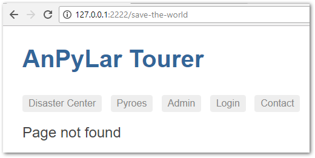

Advanced Tourer Sample
######################

*AnPyLar* includes a more advanced sample which mixes modules, submodules,
child routes, whilst building on all the concepts from the *Tour of Pyroes*
tutorial. It is also akin to the more advance routing sample from *Angular*, to
validate the concepts and design choices made when developing *AnPyLar*

See the sample live: `Tourer Sample <https://www.anpylar.com/tutorial/tourer>`_

Let's have a look at it

.. tabs::

   .. code-tab:: bash layout

       tourer
       ├── app
       │   ├── admin
       │   │   ├── __init__.py
       │   │   ├── admin_component.py
       │   │   ├── admin_dashboard_component.py
       │   │   ├── admin_module.py
       │   │   ├── manage_disasters_component.py
       │   │   └── manage_pyroes_component.py
       │   ├── compose_message
       │   │   ├── __init__.py
       │   │   ├── compose_message_component.html
       │   │   └── compose_message_component.py
       │   ├── disaster_center
       │   │   ├── __init__.py
       │   │   ├── disaster_center_component.py
       │   │   ├── disaster_center_home_component.py
       │   │   ├── disaster_center_module.py
       │   │   ├── disaster_detail_component.py
       │   │   ├── disaster_list_component.py
       │   │   └── disaster_service.py
       │   ├── login
       │   │   ├── __init__.py
       │   │   ├── login_component.py
       │   │   └── login_module.py
       │   ├── pyroes
       │   │   ├── pyro_detail
       │   │   │   ├── __init__.py
       │   │   │   └── pyro_detail_component.py
       │   │   ├── pyroes
       │   │   │   ├── __init__.py
       │   │   │   └── pyroes_component.py
       │   │   ├── __init__.py
       │   │   ├── pyro_service.py
       │   │   └── pyroes_module.py
       │   ├── __init__.py
       │   ├── app_component.py
       │   ├── app_module.py
       │   ├── auth_guard_service.py
       │   ├── auth_service.py
       │   ├── dialog_service.py
       │   └── page_not_found_component.py
       ├── assets
       │   └── app.css
       ├── anpylar.js
       ├── index.html
       ├── package.json
       └── styles.css

The key to managing this (more complex than in any of the *Tour of Pyroes*
samples) structure is in the ``app_module.py``. Let's have a look at it.

.. tabs::

   .. code-tab:: python app_module.py

      class AppModule(Module):

          modules = LoginModule, PyroesModule

          components = AppComponent

          bindings = {}

          services = {
              'auth_service': AuthService,
              'dialog_service': DialogService,
          }

          routes = [
              {'path': 'compose', 'component': ComposeMessageComponent,
               'outlet': 'popup'},

              {'path': 'disaster-center', 'load_children': [DisasterCenterModule]},

              {'path': 'admin', 'load_children': [AdminModule]},

              {'path': '', 'redirect_to': '/superpyroes', 'path_match': 'full'},

              {'path': '*', 'component': PageNotFoundComponent},
          ]

   .. code-tab:: python app_module imports

      from anpylar import Module

      from .app_component import AppComponent
      from .compose_message import ComposeMessageComponent
      from .page_not_found_component import PageNotFoundComponent

      from .admin import AdminModule
      from .disaster_center import DisasterCenterModule
      from .pyroes import PyroesModule
      from .login import LoginModule

      from .auth_service import AuthService
      from .dialog_service import DialogService

To reduce clutter and show where the complexity is actually managed, we have
separated the actual *Module* class declaration from the *imports* (which are
needed for all the declarations/defininitions inside the class, of course)

Component Bootstrapping
***********************

.. code-block:: python

    components = AppComponent

Even if routes and routes via submodules are in place, if a component is
defined in the ``components`` directive for bootstrapping, it will be
instantiated and put in action before the routing engine takes over.

In this case, ``AppComponent`` creates the top navigation bar and offers the
main slot for route rendering by providing a ``<router-outlet>`` tag.

.. code-block:: python

    class AppComponent(Component):
        stylepath = None

        htmlsheet = '''
        <h1 class="title">AnPyLar Tourer</h1>
        <nav>
          <a routerLink="/disaster-center" routerLinkActive="active">Disaster Center</a>
          <a routerLink="/superpyroes" routerLinkActive="active">Pyroes</a>
          <a routerLink="/admin" routerLinkActive="active">Admin</a>
          <a routerLink="/login" routerLinkActive="active">Login</a>
          <a routerLink="/compose" routerLinkActive="active">Contact</a>
        </nav>
        <router-outlet></router-outlet>
        <router-outlet name="popup"></router-outlet>
        '''

Notice that:

  - There are no accompanying ``.html`` and ``.css`` files.

  - The html content is in the ``htmlsheet`` directive and ``stylepath = None``
    indicates that there is no specific private style for this component.

    .. note:: This same development pattern is repeated in this sample for
              components, in which *html* and *css* are embedded in the Python
              code

Loading submodules
******************

Submodules via ``modules``
==========================

With the ``modules`` directive

.. code-block:: python

     class AppModule(Module):
         ...

         modules = LoginModule, PyroesModule

         ...

By declaring both ``LoginModule`` and ``PyroesModule`` as submodules of our
module, the following will happen.

  - Any ``routes`` declared inside those modules will become part of the route
    hierarchy defined in our main module

Let's see the routes in those two modules

.. tabs::

   .. code-tab:: python login_module.py

      class LoginModule(Module):
          routes = [
              {'path': 'login', 'component': LoginComponent}
          ]

   .. code-tab:: python pyroes_module.py

      class PyroesModule(Module):
          ...

          routes = [
              {'path': 'pyroes', 'redirect_to': '/superpyroes'},
              {'path': 'superpyroes', 'component': PyroesComponent},
              {
                  'path': 'pyro',
                  'redirect_to': '/superpyro'},
              {
                  'path': 'superpyro',
                  'params': {'pyd': int},
                  'component': PyroDetailComponent,
              }
          ]

Submodules via ``routes``
=========================

.. code-block:: python

     class AppModule(Module:
         routes = [
             ...

             {'path': 'disaster-center', 'load_children': [DisasterCenterModule]},

             {'path': 'admin', 'load_children': [AdminModule]},

             ...

Using ``load_children``, routes from the ``Module`` classes provided are loaded
and added to the routing hierarchy.

The corresponding routes.

.. tabs::

   .. code-tab:: python disaster_center_module.py

      class DisasterCenterModule(Module):
          ...

          routes = [{
              'path': '',
              'component': DisasterCenterComponent,
              'children': [
                  {
                      'path': '',
                      'component': DisasterListComponent,
                      'children': [
                          {
                              'path': '',
                              'component': DisasterDetailComponent,
                              'params': {'did': int},  # transformation function
                          },
                          {
                              'path': '',
                              'component': DisasterCenterHomeComponent,
                          }
                      ]
                  }
              ]
          }]

   .. code-tab:: python admin_module.py

      class AdminModule(Module):
          routes = [{
              'path': '',
              'component': AdminComponent,
              'can_activate': AuthGuard,
              'children': [{
                  'path': '',
                  'children': [
                      {'path': 'disasters', 'component': ManageDisastersComponent},
                      {'path': 'pyroes', 'component': ManagePyroesComponent},
                      {'path': '', 'component': AdminDashboardComponent}
                  ]
              }]
          }]

In both cases the routing hierarchy is further extended by:

  - Using ``children``, which is again an iterable or route definitions (just
    like the main ``routes`` directive in which it is embedded)

Both do also show:

  - How *empty* paths can be used to add *Component* instances to the
    hierarchy, but which do not contribute to path matching

    This can be, for example, used to have components which add some initial
    rendering or provide some joint functionality, which could be a *service*
    shared by all underlying components.

An excerpt.

.. code-block:: python

    ...

    'children': [
        {
            'path': '',
            'component': DisasterListComponent,
            'children': [
                {
                    'path': '',
                    'component': DisasterDetailComponent,
                    'params': {'did': int},  # transformation function
                },

    ...

Guards
******

Activation
==========

The sample also shows in the routes definition, how a component can be guarded
from activation. A number of reasons may exist for it. In the example a *login*
is implemented if the user is not yet logged in and access to the ``Admin``
part of the sample.

Guarding the route is implemented with a subclass of ``AuthGuard``, which
provides a *service*, which has to be started in a ``services`` directive.

The location in our layout

.. code-block:: bash

       tourer
       ├── app
       │   ├── ...
       │   ├── auth_guard_service.py
       │   ├── auth_service.py
       │   ├── ...
       ├── ...

We have left ``auth_service.py`` there because it is the service which our
``AuthGuard`` uses to check for the login status and to long in.

And the declaration in the ``routes`` directive of ``AdminModule``.

.. code-block:: python

    class AdminModule(Module):
        routes = [{
            'path': '',
            'component': AdminComponent,
            'can_activate': AuthGuard,
            ...

        }]

Implementing our ``AuthGuard`` is achieved by subclassing the ``AuthGuard``
class in *AnPyLar* and then overriding the ``can_activate`` method.

.. code-block:: python

    from anpylar import AuthGuard

    class AuthGuard(AuthGuard):

        def can_activate(self, route):
            return self.check_login(route.path)

        def check_login(self, path):
            if self.auth_service.is_logged:
                return True

            self.auth_service.redir_path = path
            self.router.route_to('/login', session_id=1234567890)
            return False

In the sample the work is delegated to the ``check_login`` method, which uses
the ``auth_service`` (as explained above) to check for the login status.

Deactivation
============

The sample also adds a *deactivation* control. This function is delegated in
*AnPyLar* to a *Component* instance. The rationale: the instance knows if there
may, for example, be something pending which should prevent navigating away.

In the sample this is implemented in the detail editing part of the *Disaster
Center*.

.. code-block:: python

    class DisasterDetailComponent(Component):
        htmlsheet = '''
            ...
            <button (click)="router.route_to('')">Cancel</button>
            ...
        '''

        ...

        def can_deactivate(self):
            if not self.edit_did or self.selected.name == self.edit_name:
                return True

            # dialog_service is in the main module
            return self.dialog_service.confirm('Discard changes?')

The snippet shows the relevant parts of the code

  - The *Cancel* button which creates a binding to ``router.route_to('')`` when
    pressed.

    This ``''`` route might seem a nonsense, but remember (as seen above) that
    we have a hierarchy of routes with ``{'path': '' ...}``, i.e.: routes that
    add no path but instantiate componentes.

    That why routing to ``''`` makes sense: we are routing within the same
    hierarchy. In this particular case we know the routing engine won't select
    the ``DisasterDetailComponent`` because no parameter is passed (which is
    the tie breaker for our hierarchy with no path additions)

Because ``router.route_to('')`` would be navigating away from our actual
component, the routing engine checks the active component,
``DisasterDetailComponent``, to see if this is possible by invoking ``can_deactivate``.

  - ``can_deactivate`` checks if actual editing has taken place and if so, it
    will use the ``dialog_service`` to request confirmation.

    ``dialog_service`` starts an asynchronous operation which is returned as an
    *Observable* which is further returned to the the caller (the internal
    engine)

    Any value returned by ``can_deactivate`` which is not an *Observable* (like
    ``True`` in the snippet above) will be internally turned into an
    *Observable* with the ``of`` operator, for consistency, keeping the
    operation asynchronous and thus not blocking the user interface.

Not Found
*********

In case a link is not found, the routing engine offers the possibility to
define a last resort route (or catch-all) which works as the usual *Not Found*
pages.

The definition is in the main ``routes`` directive in ``AppModule``.

.. code-block:: python

      class AppModule(Module):
          ...

          routes = [
              ...
              {'path': '*', 'component': PageNotFoundComponent},
          ]

By specifying ``'path': '*'`` (or ``**`` if wished) this will be the last
resort route. To test it the sample offers a ``Save the World`` button in the
``PyroesComponent`` which routes to ``/save-the-world``

.. image:: not-found-01.png

When the button is clicked, the routing engine takes the application to the
``PageNotFoundComponent``, which in this case is really simple.

.. code-block:: python

    class PageNotFoundComponent(Component):
        htmlsheet = '''
        <h2>Page not found</h2>
        '''

Producing the following result on-screen.

Named Outlet Routing
********************

In addition to the regular routing to the ``<router-outlet>`` tag, named outlet
routing is also possible. This functionality is used in the sample to show a
*contact* dialog, which travels across paths in the independent named
outlet.

The declaration is made in the main component of our application:
``AppComponent``. Recalling the contents of ``app_component.py``.

.. code-block:: python

    class AppComponent(Component):
        htmlsheet = '''
        <h1 class="title">AnPyLar Tourer</h1>
        <nav>
          <a routerLink="/disaster-center" routerLinkActive="active">Disaster Center</a>
          <a routerLink="/superpyroes" routerLinkActive="active">Pyroes</a>
          <a routerLink="/admin" routerLinkActive="active">Admin</a>
          <a routerLink="/login" routerLinkActive="active">Login</a>
          <a routerLink="/compose" routerLinkActive="active">Contact</a>
        </nav>
        <router-outlet></router-outlet>
        <router-outlet name="popup"></router-outlet>
        '''

        stylepath = None

Where we can see the syntax::

  <router-outlet name="popup"></router-outlet>

The named outlet has a corresponding entry in the ``routes`` of ``AppModule``::

        {'path': 'compose', 'component': ComposeMessageComponent,
         'outlet': 'popup'},

which translates to:

  - For ``'path': 'compose''``

  - Instantiate ``ComposeMessageComponent``

  - And place it under::

      <router-outlet name="popup"></router-outlet>

If we see our application at the *Disaster Center* (resizing the app to fit the
view of the developer tools)

.. image:: named-outlet-01.png

In the Elements box, the named outlet tag has been highlighted. Clicking on
``Contact`` produces the following.

Without disturbing the main view in ``<router-outlet>``, the contact form has
been displayed inside ``<router-outlet name="popup">``. Moving to a different
part of the application carries across the open form (we have added a message
before moving away to show how the component remains unaltered)

As shown a named outlet is not meant to be closed by navigating away from the
route, because it has not changed the path and is transparently carried over,
we need to be specific about how to close the outlet. Let's see the code for
the ``ComposeMessageComponent``

.. code-block:: python

    class ComposeMessageComponent(Component):
        bindings = {
            'details': '',
            'msg': '',
        }

        def unloading(self):
            # return to default state when unloading for next load
            self.details = ''
            self.msg = ''

        def render(self, node):
            d = node.select('div[name="details"]')  # will get first
            d._display(bool(self.details_))
            d._fmt(details=self.details_)

            t = node.select('textarea')._fmtvalue(self.msg_)

            p = node.select('p[name="buttons"]')
            p._display(self.details_ == '')
            bsend = node.select('button[name="send"]')
            bsend._bindx.click(self.send)
            bcancel = node.select('button[name="cancel"]')
            bcancel._bindx.click(self.close_popup)

        def send(self):
            self.details = 'Sending Message ...'
            # the message would be available in self.msg

            Observable.of(True) \
                .delay(2000) \
                .subscribe(self.close_popup)

        def close_popup(self, close=True):
            self.close_outlet()

Nothing should be groundbreaking except the last method: ``close_popup``, which
is for example used after *sending* (is added as a subscription to the
*Observable*) and invokes::

  self.close_outlet()

I.e.: a *Component* instance has a specific method which allows closing the
named outlet in which it is being displayed.

Conclusion
**********

The rest of the functionalities in the sample build on the concepts from the
*Tour of Pyroes* tutorial and do simply offer variations of file layout, like
in the ``disaster_center`` module.

.. code-block:: bash

       tourer
       ├── app
       │   ├── ...
       │   ├── disaster_center
       │   │   ├── __init__.py
       │   │   ├── disaster_center_component.py
       │   │   ├── disaster_center_home_component.py
       │   │   ├── disaster_center_module.py
       │   │   ├── disaster_detail_component.py
       │   │   ├── disaster_list_component.py
       │   │   └── disaster_service.py
       │   ├── ...
       ├── ...
       └── styles.css

Here and instead of having the different components in subdirectories, the
usual pattern in the *Tour of Pyroes*, all components are in the same directory
with the module.

Because the components have the html code embedded in ``htmlsheets`` directives
in the Python code, this may be a convenient layout, as there are no separate
``.html`` files (and this case neither ``.css`` files)

Have a look and play with the elements.
